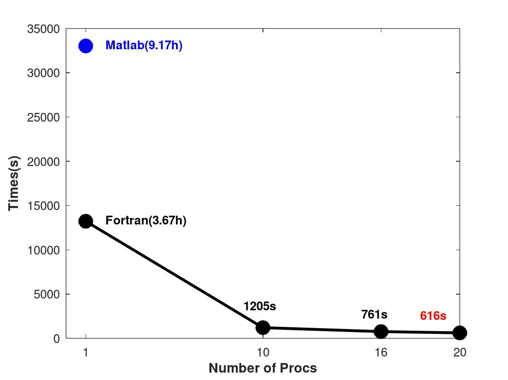
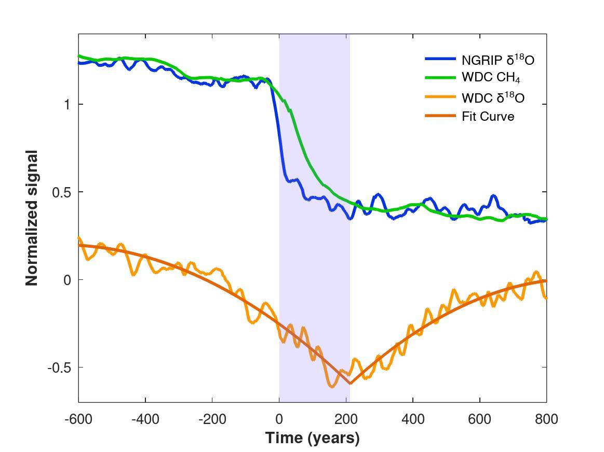

<p align="center">
 
</p>

<p align="center">
    
    
</p>

<p align="center">
 
</p>

### Introduction
The program is a Monte Carlo simulation to calculate the interhemispheric phasing of the bipolar seesaw. Rewritten from a MATLAB version, downloaded from https://doi.org/10.1038/nature14401.

Notice:
1. Some programs are downloaded from network, such as `fitting.f90` and `interp_linear.f90`, and modified by Qun Liu. Thanks for the authors of the open source programs.
2. The program also needs `lapack` and `Intel MKL` (Math Kernel Library), please modify the library paths in `Makefile`.

Usage (run the Monte Carlo simulation with Fortran and MPI):
```bash
$ make
$ nohup make run &> MC_result &
```
The results will be writen to `t_MC.dat` and `t_MCc.dat` for warm and cool events, respectively.

Plot the figures (need Matlab/Octave):
```bash
$ cd scripts 
$ ./run.sh
```

### Reference:
* WAIS Divide Project Members. Precise interpolar phasing of abrupt climate change during the last ice age. *Nature* 520, 661–665 (2015). DOI: [10.1038/nature14401](https://doi.org/10.1038/nature14401).
